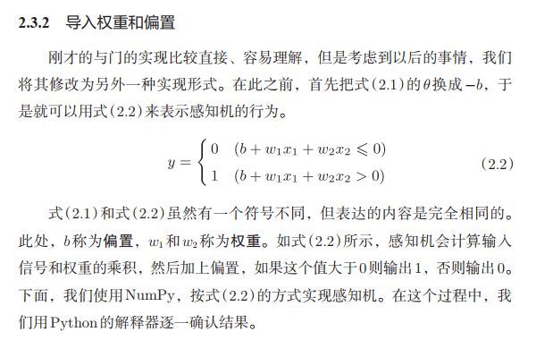

### 感知机接收多个输入信号，输出一个信号。

$y=\left\{\begin{array}{ll}{0} & {\left(w_{1} x_{1}+w_{2} x_{2} \leqslant \theta\right)} \\ {1} & {\left(w_{1} x_{1}+w_{2} x_{2}>\theta\right)}\end{array}\right.$

### 与非门(NAND gate)

**page in 30**

感知机的局限性在于它只能表示有一条直线分割的空间。对于非线性空间无法解决。

使用多层感知机来解决非线性空间问题。

 x1  ------- NAND

​                                       ---          AND

x2   -------  OR

